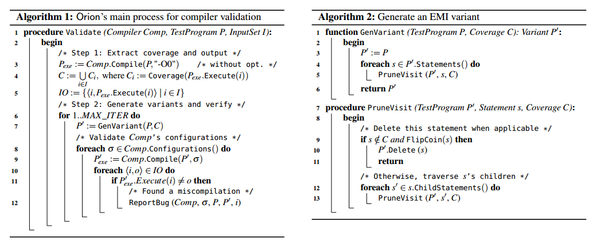

#流程
1. 读入文件，语法分析，找到插入函数的位置。
2. 插入函数，编译，统计覆盖的代码（针对多次输入）
3. `可以删除的位置 = 插入函数的位置 - 覆盖的代码。`
4. 语法分析，随机选择可以删除的位置，确保不会引入新的语义错误，随机删除，重新编译或使用优化参数重新编译。

后续要做的：自动生成测试样例，检测正确性（clang做）。


难点：

* 执行中间代码，处理输入输出

 

```
cc=COMPILER_TO_CHECK
for each test.c:
	CHECK_SYNTAX_CHECK:
	check_src_validation_by_clang(add read()/write() delcation.) 
		and compile_by_cc (they should be same)
	
	GET_CODE_COV:
	insert _my_func in test.c(use clang to find where to insert)
	cc compile test_inserted.c > a.ir
	for all inputs:
		a.ir executed by irsim-cli.py
		parse stdout and get coverage.
	get code coverage & <input, output>
	
	ITERATE:
	random delete(or change) unexecuted code, get test_new.c 
	for all optimization level:
		cc compile test_new.c > a_new.ir
		for all inputs:
			a_new.ir executed by irsim-cli.py
			assert(a_new.ir(input)==output[input])
		
//TODO: compare with clang, generate C-- code.
```

